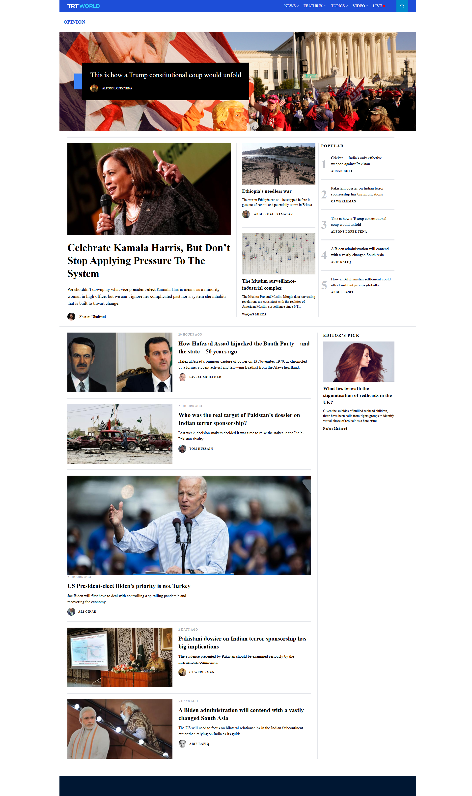

# News UI

Responsive news interface built with React. It displays news and media content with a modern design featuring carousel, opinion sections, and organized content layers.

Live demo: [News UI](https://ismailcubuk.github.io/news-ui/)



## Features

- Display news and media content
- Carousel component for featured articles
- Opinion section for highlights
- Responsive design for desktop, tablet, and mobile
- Modern navigation bar
- Professional footer
- Organized content layers
- Image galleries with thumbnails

## Tech Stack

- React 18
- Tailwind CSS
- React Icons
- JavaScript

## Project Structure

```text
src/
  components/
    navbar/
      Navbar.js
    main/
      Carousel.js
      Layer1.js
      Layer2.js
      Footer.js
      LeftSection.js
      MiddleSection.js
      PopularSection.js
    Opinion.js
    Dividers.js
  images/
    background/
    profilePictures/
    thumbs/
  svg/
    Logo.jsx
  App.js
  index.css
  index.js
```
